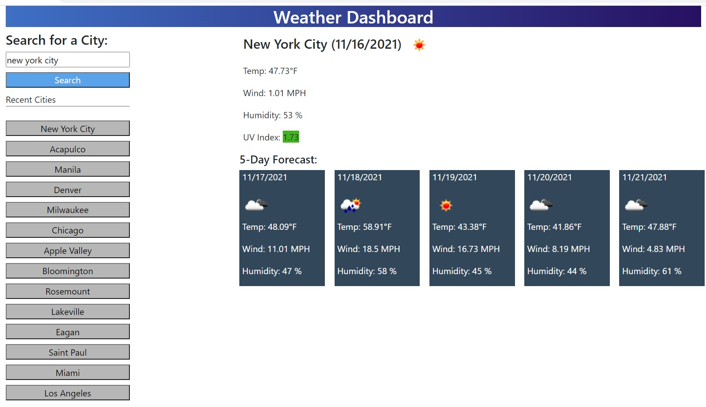
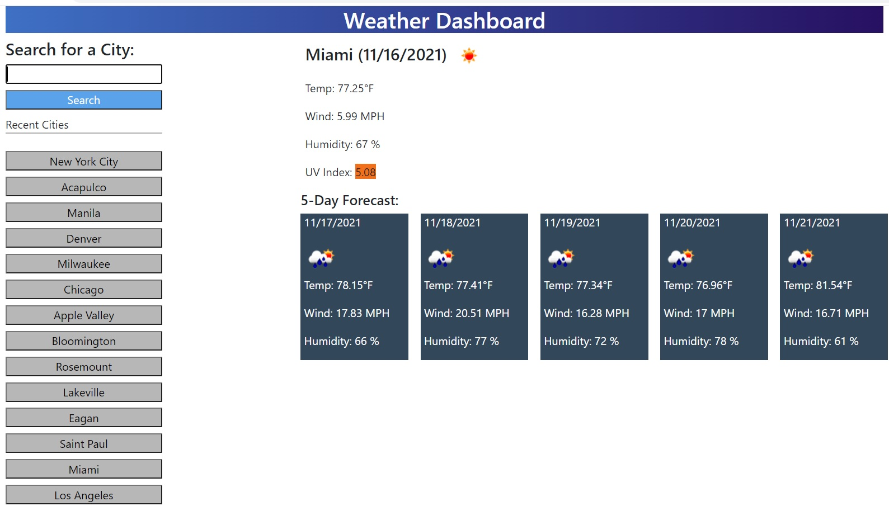
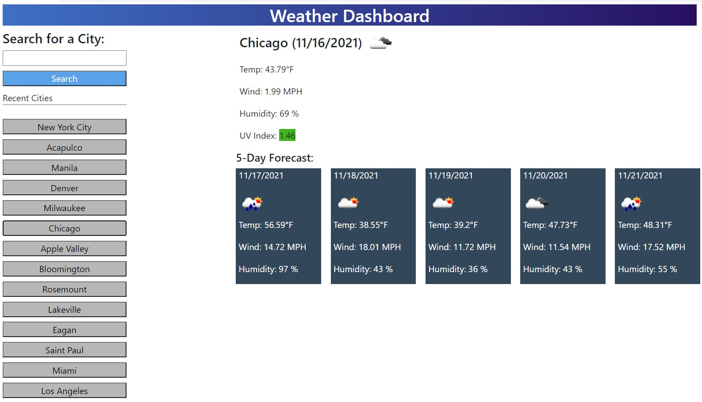

# Weather Dashboard

## Description
This app will allow you to enter a city and display the current and 5-day weather forecast. It will display the dates, the temperature, the wind speed, the humidity, the UV index, and the image representation of the weather condition.

**Note:** ***You are required to use your own Open Weather API-Key***

## Tech/Framework
* HTML
* CSS
* Bootstrap
* JavaScript
* jQuery
* Open Weather API

## Technical Requirements
* Search for a city and display the current and 5-day weather forecast.
* The current weather should display the following: city name, date, icon representation of weather conditions, temperature, humidity, wind speed and UV index.
* The 5-day forecast should display the following: date, icon representation of weather conditions, temperature, wind speed, and humidity.
* Save search history using localStorage and create buttons for each of the city.
* Color coding UV Index background based on risk.

## Added Feature
* Capitalized every first letter of the city name in the current weather section and recent cities searched.
* Most recent city searched button is created at the top of the list.
* Responsive screen layout.

## Screenshots
* New Search   
* Recently searched city sample 1   
* Recently searched city sample 2   

## Weather Dashboard App Link
[Weather you like it or else 🌦](https://jojobautistaum.github.io/weather-dashboard/)